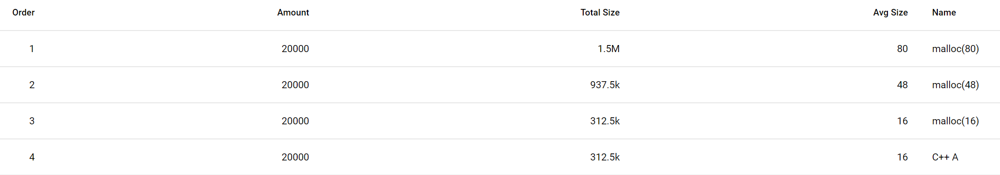

内存 profile 有两种方式，一种是 tcmalloc 或 jemalloc 中对 malloc/free 进行采样解栈统计的做法，另外一种是直接分析 coredump 文件中内存数据。
前者能统计出来哪些代码分配了大量内存，帮助定位**可重现**的 C/C++ 内存泄漏问题的原因。
对于**只有现场，无法重现**的 C/C++ 内存泄漏问题，只有通过后者的方式才能准确判断原因。本文主要介绍这方面的一些方法。

## 太长不看

1. 根据指针分布对相同大小的内存块作分类，识别出疑似同类对象的块
2. 根据我指向了谁，反推我是什么
3. 根据谁指向了我，正推我是什么

## 前提工作

具体见 [非侵入式的 Python 内存用量分析工具](https://km.netease.com/article/309535)，该文已经完成了这些工作：
- 对某个时刻下某个进程生成 coredump 文件
	- coredump 文件中的数据就是该进程当时的所有内存数据，即可以访问到该进程在那一瞬间的所有内存数据
- 得到所有被 malloc() 分配出来的内存的地址和大小
	- 根据某个特定的规律识别出来部分内存块是什么
		- 比如说 C++ 中有虚表的对象，内存块上会有指针指向虚表
		- 比如说 Python 中 PyObject 包含 ob_type 字段，会指向合法的 PyTypeObject

举个例子，通过统计大小和出现次数，以下代码可以得出后面截图中的结果：

```c++
#include <stdlib.h>
#include <stdio.h>
#include <unistd.h>
#include <sys/types.h>

class A {
public:
    class B* b;
    virtual void func() {
    }
};

class B {
};

int main() {
    printf("pid %ld ppid %ld\n", (long)getpid(), (long)getppid());
    int i;
    int N = 20000;
    for (i = 0; i < N; i++) {
        malloc(48);
        malloc(80);
        A* a = new A();
        B* b = new B();
        a->b = b;
    }
    scanf("%d", i);
    return 0;
}
```

我们只关心是什么东西用了最多内存，即只关注 TopN 内存占用最高的结果：
- 第一二行分别对应  malloc(80) 和 malloc(48) 返回的内存
- 第三行，其实是 `class B`的对象，不过也因为没有规则自动分析出来，所以识别成未知的大小为 16 的块 `malloc(16)`
- 第四行，特别的，根据虚表判断出是 `class A` 的对象
 
malloc(*) 这些内存块上面的数据没有很明显的特征，很难程序自动分析出来这些内存放了什么，接下来介绍有什么方法可以帮助解决这个问题。



## 内存块的本身

### 指针的判断与分布

给定某个小大的某块内存块，内存块上面的数据就是一堆随机的 2 进制，很难从肉眼去识别它是什么，或者说这块内存放的是什么东西。

现代的硬件通常会做内存对齐，64 位系统下，一个地址的大小为 8 个字节，所有的地址都能整除 8。

假设现在有地址为 0x7f5e787d64b0 大小为 64字节 的一块内存，使用 gdb 按 8 个字节大小分离查看它的数据的话有以下输出：

```
(gdb) x/8xg 0x7f5e787d64b0
0x7f5e787d64b0: 0x0000120400000001      0x0000564261d50f00
0x7f5e787d64c0: 0x0000a000a0000004      0x0000000000000004
0x7f5e787d64d0: 0x0000000000000007      0x00007f5e787d64e8
0x7f5e787d64e0: 0x00005642619153a0      0x0000000000000000
```

如果有 gdb 使用经验的话，像 0x0000564261d50f00 0x00007f5e787d64e8 0x00005642619153a0 这样的数值应该能明显看出来它们就是内存地址（也就是指针）。

而一个进程内有效的虚拟内存的地址范围可以通过查看 /proc/[pid]/maps 得到：

```
$ cat /proc/24676/maps
56426180d000-564261b34000 r-xp 00000000 fd:00 8427963                    /usr/bin/python2.7
564261d33000-564261d35000 r--p 00326000 fd:00 8427963                    /usr/bin/python2.7
564261d35000-564261dac000 rw-p 00328000 fd:00 8427963                    /usr/bin/python2.7
564261dac000-564261dcf000 rw-p 00000000 00:00 0
564263356000-56426343b000 rw-p 00000000 00:00 0                          [heap]
...
7f5e787ad000-7f5e78922000 rw-p 00000000 00:00 0
```

虽然无法确定像 0x0000120400000001 0x0000a000a0000004 这样的数据具体是什么，但是对于这块内块内存，我们可以通过按照 8个字节分割数据的方式，尝试把每 8个字节所代表的数值解释成内存地址。
通过判断数值是不是能整除 8，是不是在 /proc/[pid]/maps 的内存分布中，我们能确定这个数值是不是一个合法的内存地址。
也就是说，我们能确定这块内存中有哪些位置有指针（内存地址）。

### 根据指针分布做分类

前提工作中提到，可以得到所有被 malloc() 分配出来的内存的地址和大小，即可以得到所有相同大小的内存块的地址。

某个类型的所有对象的指针分布大概率都是差不多的（可能有的对象的某些指针成员被置空）。
因此，对于某个大小的所有内存块，我们可以按照指针分布来做分类，把有相同大小且相同指针分布的内存归为一类。

比如有下面 4块 16 字节大小的内存：
- 0x7f5e787d44b0 和 0x7f5e787d74b0 都没有指针，可以归为 1类。
- 0x7f5e787d54b0 和 0x7f5e787d64b0 都在偏移量8个字节处有1个指针，可以归为 1类。

```
(gdb) x/2xg 0x7f5e787d44b0
0x7f5e787d44b0: 0x0000120400000001      0x0000120400000001

(gdb) x/2xg 0x7f5e787d54b0
0x7f5e787d54b0: 0x0000120400000002      0x0000564261d50f00

(gdb) x/2xg 0x7f5e787d64b0
0x7f5e787d64b0: 0x0000120400000002      0x0000564261d50e00

(gdb) x/2xg 0x7f5e787d74b0
0x7f5e787d74b0: 0x0000120400000002      0x0000120400000004
```

按照指针分布做了二次分类之后，我们就能挑出频率多的指针分布对应的内存，专门研究它们是什么，找出来是什么占用了很多内存。

### 我之指向

知道一块内存有哪些指针之后，其实就是知道这块内存指向其他哪些内存。
在前提工作中我们已经能识别出来某些内存块是什么了，也就是说我们可能能知道这块内存指向的其他内存是什么。
假设我们知道目标内存块指向某个类型 C 的对象，那么通过搜索阅读所有使用类型 C 的相关代码，我们可能能反推出来目标内存是什么。
利用虚表地址判断一块内存是不是某个 C++ 类的对象正是基于这一点。

### 利用指针分布进行类型匹配

再来考虑一块内存内里面通常会放什么（可能这里考虑还不够全面）：
下面的`对象`指的是 C/C++ 中的 struct/class 的实例。

1. 一个对象或 N 个对象
2. 一个对象的一部分，比如说容器类的数据结构，`std::vector` 可能会使用额外的内存存放容器内的元素

第 2 种情况可能也理解为第 1 种情况，比如说元素类型为 A 的容器类型 B 的额外管理元素的内存里面通常是放着 N 个 A。
可能某些 C 写的容器会特别点，元素不止是 A，可能还会有额外的头部。

在有被分析目标程序的调试信息时，可以通过调试信息获得每个类型有哪些成员，这些成员是不是指针以及成员所处的内存偏移位置。

假定这块内存就是放着某个类型的 N 个(可能有的额外的头部+)  对象，那么通过测试与所有类型的指针成员偏移位置分布进行对比测试，可以得出这块内存可能的一组候选类型。
对于这组候选类型里的每一个类型，可以在 gdb 里强制把这块内存的地址转为该类型并打印输出，肉眼查看这块内存数据按照这个类型解释后每个成员数据是否合理。

（只是提出想法，具体操作麻烦，我没有真的这么实践过）

## 我是我之因果的所有指向 by 猫腻

前文提到我们可以拿到所有的内存块，知道这些内存块之间哪里有指针。
而指针就是**指针所在的内存块**与**指针指向的地址所在的内存块**的引用关系，通过指针我们可以知道内存块之间的引用关系。

给定一块某个地址的`目标内存`，我们可以通过引用关系找到引用（指向）它的内存块，一层一层反向画出来这块内存的反向引用图。

只要我们能知道图中任意一块内存或者地址是什么，那么我们就从这块内存/地址出发，根据它的类型信息，一步一步往前正向推导，最终得出目标内存是什么出来。

而前提工作中我们已经能根据虚表或者 Python 虚拟机的规则，知道大部分的内存块是什么了。

### 示例1

以文章开头的例子为例，通过分析结果可以知道第三行中有大量无指针（这算是一种特殊的指针分布）的 16字节的内存块。

取其中一块 0x55ccba2eac10 观察分析，只有 0x55ccba2eabf0 在第二个字节指向它。
通过自动分析可以知道 0x55ccba2eabf0 属于第四行中 `class A` 的对象，配合调试信息中的类型信息，可以知道 A 的第二字节为 `b` 成员，即 0x55ccba2eac10 这块内存放了 `class B` 的对象。

```
(gdb) x/2xg 0x55ccba2eac10
0x55ccba2eac10: 0x0000000000000000      0x0000000000000000

(gdb) x/2xg 0x55ccba2eabf0
0x55ccba2eabf0: 0x000055ccb87bada8      0x000055ccba2eac10

(gdb) ptype A
type = class A {
  public:
    B *b;

    virtual void func();
}
```


### 示例2

再举个简单的例子，已有某块内存 0x7f5e787d64b0，在 0x7f5e787d64d8 处引用了 0x00007f5e787d64e8。

```
(gdb) x/32xg 0x7f5e787d64b0
0x7f5e787d64b0: 0x0000000000000001      0x0000564261d50f00
0x7f5e787d64c0: 0x0000000000000004      0x0000000000000004
0x7f5e787d64d0: 0x0000000000000007      0x00007f5e787d64e8
0x7f5e787d64e0: 0x00005642619153a0      0x0000000000000000
0x7f5e787d64f0: 0x0000000000000000      0x0000000000000000
```

假设我们不知道 0x00007f5e787d64e8 是什么。
但是通过前提工作，我们能知道 0x7f5e787d64b0 是一个 PyDictObject，因此就能根据 PyDictObject 的类型信息知道 0x00007f5e787d64e8 对用的是 PyDictObject 的 ma_table 成员，从而知道 0x00007f5e787d64e8 是什么。

```
(gdb) p *(PyDictObject*)0x7f5e787d64b0
$1 = {ob_refcnt = 1, ob_type = 0x564261d50f00 <PyDict_Type>, ma_fill = 4, ma_used = 4, ma_mask = 7, ma_table = 0x7f5e787d64e8, ma_lookup = 0x5642619153a0 <lookdict.lto_priv>,
  ma_smalltable = {{me_hash = 0, me_key = 0x0, me_value = 0x0}, {me_hash = 1, me_key = 1, me_value = 1}, {me_hash = 2, me_key = 2, me_value = 2}, {me_hash = 3, me_key = 3,
      me_value = 2}, {me_hash = 4, me_key = 4, me_value = 2}, {me_hash = 0, me_key = 0x0, me_value = 0x0}, {me_hash = 0, me_key = 0x0, me_value = 0x0}, {me_hash = 0, me_key = 0x0,
      me_value = 0x0}}}
```

### 全局变量

特别的，有些内存地址不归 malloc 管理，比如说全局变量。
我们能通过地址是不是在 /proc/[pid]/maps 中某个文件映射的内存段判断这个地址是不是全局变量，配合该文件的调试信息知道这个地址对应的全局变量是什么。

### 注意

`malloc(size)` 返回的内存块的实际大小可能会大于期望大小 `size`。malloc() 返回内存块可能是之前被 free() 过，被反复使用过 ，超过 `size`大小的部分可能残留有历史数据，这些历史数据也可能有指针。所以根据引用图推导类型的时候要注意内存块的大小与实际类型的大小是否匹配，超过实际大小的是残留数据需要被忽略。

## 例外

事实会存在内存块内无任何指针，也没有外部指针指向它的情况，这算运气不好，比较倒霉。

## 最后

本文介绍的几种方法只适合在类似外网正式服务器出现内存占用异常高的场景。这时无法通过其他方式猜到原因，无法重现，只能强行分析进程内存本身。
对于这种问题，更轻巧的方法还是找到重现的方式，改为使用 tcmalloc / jemalloc 自带 profile 工具定位原因。

上线前做压力测试可以有效提前排查出这类可能出现的内存问题。
公司内 QA 有专门的压测小组，她们积累很多压测相关经验，压测效果很好。有压测需求的话，推荐跟她们了解、对接下。


